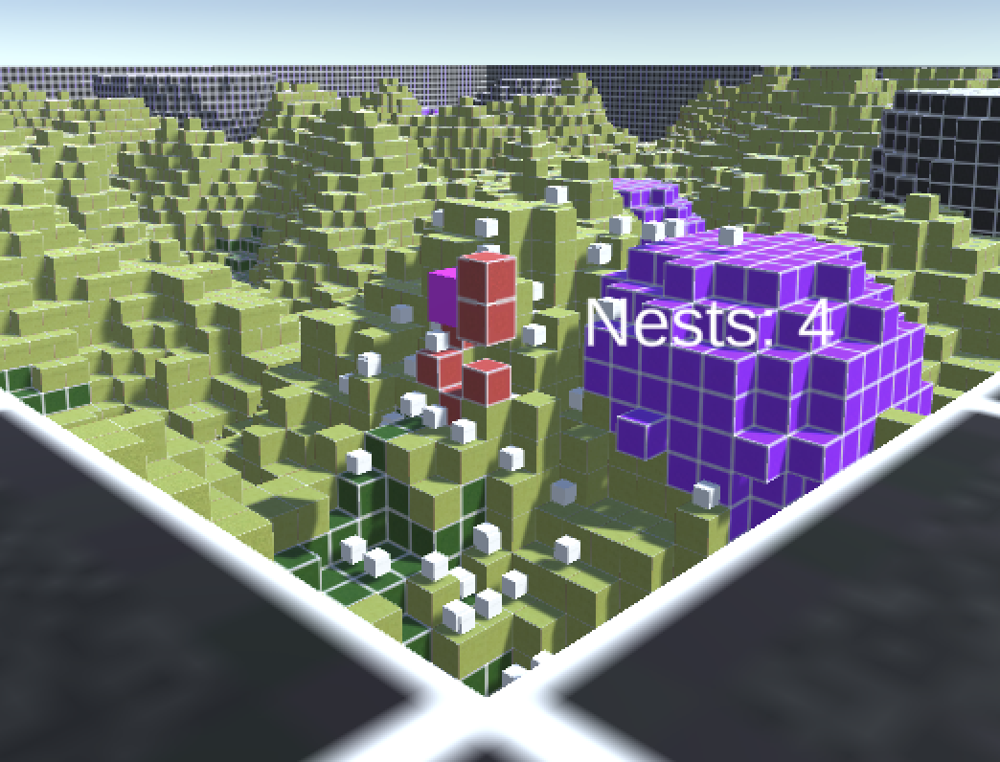
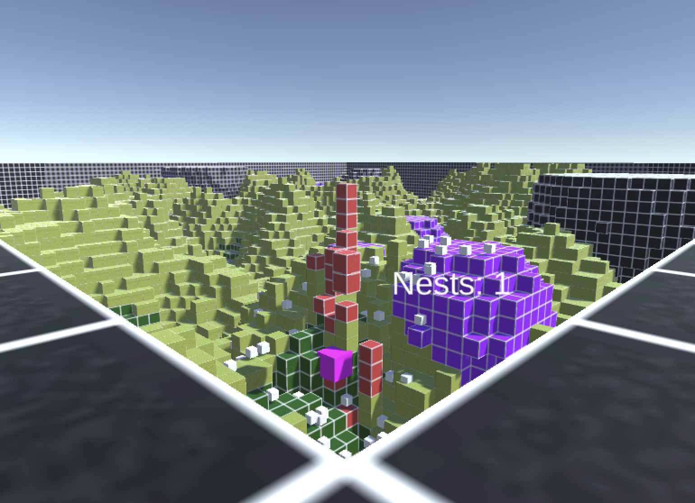

# Antymology - Evolutionary Ant Colony Simulation

<div align="center">

**An evolutionary algorithm that optimizes ant colony behavior for nest production in a 3D voxel environment**

*CPSC 565 - Emergent Computing | Winter 2026 | University of Calgary*

**Author:** Youssef Shawky

</div>

---

## 📋 Overview

Antymology is a Unity-based evolutionary simulation demonstrating emergent cooperative behavior in artificial life. Worker ants and a queen evolve survival strategies over generations to maximize nest construction through genetic algorithms.

**Key Achievement:** Ants independently evolved altruistic health-sharing behavior - sacrificing their own health to sustain the queen - resulting in a **4.75× fitness improvement** (200 → 950) within 2 generations.

---

## 🎮 Evolution in Action

<div align="center">

### Generation 1: Random Behavior

*Uncoordinated movement, queen dies early, only 2 nests produced (Fitness: 200)*

### Generation 5: Evolved Cooperation

*Workers cluster near queen, strategic health sharing, 9+ nests produced (Fitness: 950)*

</div>

---

## 🧬 The Evolutionary Algorithm

### How It Works

```
1. Spawn 1 Queen + 14 Workers with random genes
2. Evaluate for 50 seconds of autonomous behavior
3. Calculate fitness:
   - Queen: nests × 100 + (50 if alive)
   - Worker: current_health + (20 if alive)
4. Select top 50% for breeding
5. Preserve top 3 (elitism)
6. Create offspring via crossover + mutation (30% chance, ±0.2)
7. Repeat
```

### The Three Genes

| Gene | Range | Purpose | Evolved Value |
|------|-------|---------|---------------|
| `explorationRate` | 0.1-1.0 | Random movement frequency | 0.3-0.5 |
| `diggingProbability` | 0.0-0.5 | Terrain clearing near queen | 0.1-0.2 |
| `foodSeekingWeight` | 0.3-2.0 | Hunger threshold multiplier | 1.0-1.5 |

**Finding:** Moderate values consistently outperformed extremes - evolution favored balanced strategies.

---

## 🔬 Technical Implementation

### Agent AI (`AntAgent.cs`)

Decision hierarchy evaluated every 0.5s:

1. **Queen Support** - Share health if queen < 50% HP
2. **Survival** - Eat mulch when health < maxHealth × (0.6 × foodSeekingWeight)
3. **Digging** - Clear terrain near queen (probability-based)
4. **Exploration** - Random movement (rate-based)

**Core Mechanics:**
- Health decays 2 HP/s (4 HP/s on acidic blocks)
- Mulch consumption fully restores health
- Zero-sum health sharing between ants
- Movement limited to ±2 block height

### Queen Behavior (`QueenAnt.cs`)

- Produces nest every 3 seconds (cost: 33% max health)
- Magenta color, 1.5× scale for visibility
- Limited exploration to stay near nests

### Evolution System (`EvolutionManager.cs`)

**Genetic Operators:**
```csharp
// Elitism: Top 3 preserved
Elite = TopN(population, 3)

// Crossover: 50/50 inheritance
Offspring.gene = Random() < 0.5 ? Parent1.gene : Parent2.gene

// Mutation: 30% chance, ±0.2 range
if (Random() < 0.3)
    gene += RandomRange(-0.2, 0.2)
```

---

## 📊 Results

### Fitness Evolution

| Gen | Fitness | Nests | Queen | Workers Alive |
|-----|---------|-------|-------|---------------|
| 1 | 200 | 2 | ❌ | 99/100 |
| 2 | **950** ⭐ | 9 | ✅ | 100/100 |

### Emergent Behaviors

1. **Altruistic Health Sharing** - Workers evolved to sacrifice health for queen survival (not explicitly programmed)
2. **Spatial Clustering** - Workers stayed near queen for efficient cooperation
3. **Balanced Digging** - Moderate digging (0.1-0.2) outperformed extremes
4. **Proactive Eating** - Evolved threshold prevents starvation emergencies

---

## 🚀 Setup

**Requirements:** Unity 6000.3.x, TextMeshPro

1. Open project in Unity 6000.3.x
2. Load `SampleScene`
3. Press Play
4. Use WASD + Mouse to navigate

**Configurable Parameters** (EvolutionManager Inspector):
```
populationSize = 15        // Ants per generation
generationDuration = 50s   // Evaluation time
mutationChance = 0.3       // Mutation probability
mutationAmount = 0.2       // Mutation magnitude
eliteCount = 3             // Top solutions preserved
```

---

## ⚠️ Known Behavior: Floating Ants

**What:** Ants float in mid-air for ~30 seconds at generation start before falling and beginning work.

**Why:** Coroutine initialization ensures `WorldManager` completes terrain generation before ant spawning. Initial spawn position is above terrain, and Unity physics takes time to settle.

**Impact:** None - 50s evaluation window accommodates this. Consider it "planning time."

**Fix:** Raycast downward from spawn to find ground level during initialization.

---

## 🏗️ Architecture

```
Assets/
├── Components/Agents/
│   ├── AntAgent.cs            # Base behavior, genes, AI
│   ├── QueenAnt.cs            # Nest production
│   └── EvolutionManager.cs    # Genetic algorithm
└── UI/
    └── AntSimulationUI.cs     # Statistics display
```

### Key Design Decisions

**Coroutine Initialization:** Delays ant spawning by 1 frame to prevent terrain-related crashes

**Mulch Occupancy Check:** Prevents simultaneous consumption - only one ant per block

**Priority-Based AI:** Hierarchical decisions ensure critical actions (queen support) override exploration

**Zero-Sum Health:** Enforces resource scarcity - health isn't created, only transferred

---

## 🎓 Skills Demonstrated

- **AI/ML:** Genetic algorithms, multi-agent systems, emergent behavior
- **Game Development:** Unity 3D, C# programming, coroutine architecture
- **Algorithm Design:** Fitness functions, selection strategies, optimization
- **Problem Solving:** Multi-agent coordination, resource management, debugging

---

## 📚 References

- Goldberg, D.E. (1989). *Genetic Algorithms in Search, Optimization, and Machine Learning*
- Bonabeau, E., et al. (1999). *Swarm Intelligence: From Natural to Artificial Systems*
- Forked from: [DaviesCooper/Antymology](https://github.com/DaviesCooper/Antymology)

---

## 👤 Contact

**Youssef Shawky**  
CPSC 565 - Emergent Computing  
University of Calgary, Winter 2026

---

<div align="center">


</div>